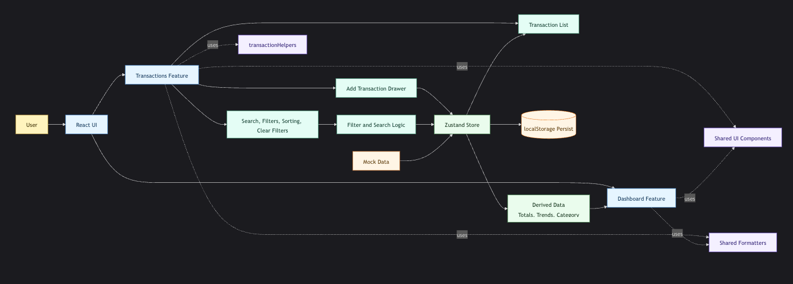

# FinFlow - Techcare Assessment

I built FinFlow which is a personal finance dashboard using React, TypeScript, and Vite.
My goal was to keep it clean, easy to read, and practical from a user perspective as per the requirements.

## Live Demo

https://thefinflow.vercel.app/

## What I Built

### Dashboard

The dashboard gives a quick overview of finances:

- Total Balance, Total Income, and Total Expenses cards
- A bar chart showing spending by category
- A 6-month spending trend displayed as an area chart

### Transactions

This is where most interaction happens:

- A transaction table with virtualized rendering for smooth scrolling (8 items visible at a time, configurable)
- Search by description
- Filters by category and status
- Sorting by date or amount (ascending/descending)
- Clear filters option
- Add Transaction drawer with form validation
- Success toast when adding a transaction

### Data & State

- Mock transaction dataset for initial data
- Zustand store with persistence
- Data stays available after refresh (persisted in localstorage)

## Tech Stack

- React 19
- TypeScript
- Vite
- Tailwind CSS
- Zustand
- React Hook Form
- Recharts
- Sonner
- Radix / Vaul UI primitives

## Local Setup and Run

### Prerequisites

- Node.js 18+
- npm

### Install

```bash
npm install
```

### Start dev server

```bash
npm run dev
```

### Build

```bash
npm run build
```

### Lint

```bash
npm run lint
```

### Preview production build

```bash
npm run preview
```

## Folder Structure

The app follows a feature-based structure to keep related code together:

For reference: https://dev.to/homayounmmdy/modular-architecture-in-react-how-to-build-scalable-and-maintainable-projects-1cbn

- `src/features/dashboard` contains the summary cards and chart sections for the analytics view.
- `src/features/transactions` contains the transaction table, filters, drawer form, hooks, types, and store.
- `src/shared` contains reusable UI components, constants, and utility helpers used across features.
- `src/lib` contains low-level helpers shared by the component layer.
- `src/features/transactions/hooks/useTransactionSummary.ts` calculates total balance, total income, expense, category breakdown and spending trend
- `src/features/transactions/hooks/useTransactionList.ts` its the configuration for virtualized list of transactions
- `src/features/transactions/hooks/useTransactionFilters.ts` it handles the filtering transactions based on category, status, sorting in asc/dsc and searching

This layout keeps business logic close to the feature that uses it and avoids turning the project into a generic component library.

## System Architecture at a Glance



## State Management

I used Zustand for application state, mainly for transactions and their derived interactions.

The reasoning was:

- I already had experience with Zustand, and given the limited time, it made more sense to rely on a familiar tool rather than introducing a new state management solution and losing focus on core functionality.
- The app only requires a small amount of shared state, so a lightweight solution with minimal boilerplate was a better fit.
- Zustand is simple, readable, and easy to maintain.
- Persistence is straightforward, allowing the store to be saved in browser storage with minimal setup.

## Trade-offs

I made a few deliberate shortcuts to stay focused on the assessment scope:

- Prioritized core functionality over detailed UI refinements.
- Used prebuilt UI components from shadcn (e.g., Button, Input, Drawer, Label) to speed up development and maintain consistency.
- The search by description is instant as this is a mock data but if the data was coming from api I'd have used debouncing method.
- Persisted data in localStorage rather than setting up a database or API layer.
- Limited the scope of features (e.g., no authentication or multi-user support) to avoid unnecessary complexity.
- Focused on a clean and maintainable structure instead of premature optimization or over-architecting.

## What I Would Improve Next

Given more time, I would extend this into a more complete product by:

- Adding date range filtering for transactions, as this is a common and expected feature in finance applications.
- Providing options to export reports (e.g., PDF or Excel) for better usability and data portability.
- Expanding analytics with more insights (e.g., spending trends by category over time, comparisons, forecasts).
- Adding unit and integration tests to ensure reliability and maintainability.

## Notes

- This is a client-side implementation using mock data.
- Transactions are persisted in browser storage.
- I prioritized clarity and maintainability over premature abstraction.
